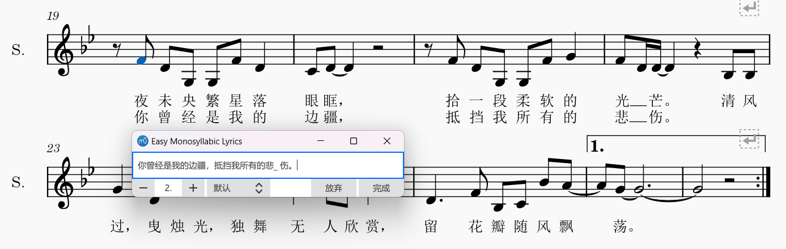
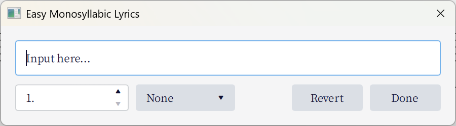

# Easy Monosyllabic Lyrics

> This is a [MuseScore](http://musescore.org/) plugin modified from [bakajikara/MuseScoreLyricsJP (日本語歌詞入力)](https://github.com/bakajikara/MuseScoreLyricsJP), ported to MuseScore 3.

Typing lyrics in monosyllabic languages (one syllable per character, no spaces between them, for example Chinese) has always been painful. We have to either type characters one by one and add spaces, or add spaces via an external text editor and paste the lyrics back by pressing Ctrl+V multiple times.

This plugin simplifies the process.

## Installation

1. Download the code and unzip it under the user's `Plugins` directory (check MuseScore preferences if you don't know where).
2. Restart MuseScore, and you should be able to activate the plugin in the plugin manager.

## Usage

Select the starting note, and run this plugin from the Plugin menu or via keyboard shortcut. The dialog will open.

Select the appropriate verse and start typing. As you type, lyrics will be added instantly onto the score (overwriting existing lyrics). After you finish, click 'Done'.

Clicking 'Revert' will discard changes to the score and close the dialog.

For advanced usage, see the [original repo](https://github.com/bakajikara/MuseScoreLyricsJP).

## Known issues

### Dialog flickering when typing in MuseScore3

MuseScore3's score view will grab the keyboard focus when a plugin changes the score, sending the dialog to background. There's no obvious way to prevent this, so this plugin simply brings the dialog to front again after making changes. This results in flickering. it is at least better than losing instant preview.

## Changes compared to bakajikara/MuseScoreLyricsJP

- Ported to MuseScore 3.
- Translate the default language of UI into English. Chinese and Japanese are available as localization.
